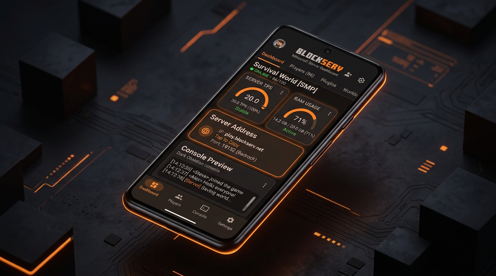

<div align="center">


# PumpkinMC Host
### High-Performance Native ARM64 Minecraft Server for Android

[](https://github.com/SSIT2051/pumpkinmc-host/actions/workflows/build-apk.yml)
[](https://github.com/Pumpkin-MC/Pumpkin)
[](https://github.com/SSIT2051/pumpkinmc-host)
[-blueviolet.svg?style=flat-square)](https://github.com/SSIT2051/pumpkinmc-host)
[](LICENSE)

<br />

<!-- Rust Themed Visitor Counter Badge -->
<table>
  <tr>
    <td align="center" style="background-color: #12100E; border-radius: 12px; padding: 12px;">
      
      <br />
      <sub><b>Project Visitor Metrics</b></sub>
      <br /><br />
      <a href="https://github.com/SSIT2051/pumpkinmc-host">
        
      </a>
    </td>
  </tr>
</table>

<p><em>An enterprise-grade, memory-safe Minecraft server host running directly on Android hardware via compiled Rust binaries.</em></p>

</div>

---

## Overview

**PumpkinMC Host** brings native server hosting to mobile devices without the performance penalties of the Java Virtual Machine. By interfacing directly with **[PumpkinMC](https://github.com/Pumpkin-MC/Pumpkin)**—a modular Minecraft server built entirely in Rust—this application delivers a sustained 20.0 TPS experience while utilizing a fraction of the CPU and memory resources required by traditional server software.

Standard mobile hosting solutions rely on heavy JVM runtimes or chroot Linux environments (such as Termux/PRoot). These environments trigger frequent garbage collection pauses, cause thermal throttling, and quickly lead to process termination by Android's Low Memory Killer (LMK). PumpkinMC Host eliminates this virtualization layer by compiling directly to native ARM64 machine code (`aarch64-linux-android`).

---

## Technical Performance Benchmarks

| Metric | Traditional JVM Server (Paper / Spigot) | PumpkinMC Host (Native Rust) | Architectural Advantage |
| :--- | :---: | :---: | :--- |
| **Baseline Heap / Memory** | 1,500 MB – 3,500 MB | **25 MB – 35 MB** | Direct OS memory management with zero JVM heap overhead |
| **Cold Startup Time** | 35 – 90 seconds | **< 900 milliseconds** | Compiled binary execution with zero JIT warmup |
| **Garbage Collection Pauses** | 50ms – 1,500ms stop-the-world spikes | **0 ms (None)** | Rust RAII compile-time memory safety without runtime GC |
| **Cross-Platform Play** | Heavy third-party Java plugins required | **Native Dual-Protocol Bridge** | Simultaneous TCP (Java) and RakNet UDP (Bedrock) routing |
| **Thermal & Battery Profile** | High thermal dissipation, rapid battery drain | **Optimized CPU sleep states** | Tokio non-blocking event loops yield idle cycles back to the OS |
| **Low-Spec Device Stability** | Frequent Out-Of-Memory (OOM) crashes | **Stable on 2GB RAM devices** | Lightweight deterministic footprint respects Android memory limits |

---

## Interface & Application Architecture

<div align="center">
  
  <p><sub><em>Material 3 Dark Theme • Real-time Performance Metrics • Network Routing Hub • Instant Hardware Tuning</em></sub></p>
</div>

### System Architecture

```
┌─────────────────────────────────────────────────────────────┐
│                 Jetpack Compose UI (Kotlin)                 │
│         Dashboard • Terminal Console • Configuration        │
└──────────────────────────────┬──────────────────────────────┘
                               │ StateFlow / Coroutines
┌──────────────────────────────▼──────────────────────────────┐
│           Android Foreground Service & Daemon Manager        │
│         CPU WakeLock • Process Isolation • Log Stream       │
└──────────────┬───────────────────────────────┬──────────────┘
               │                               │
┌──────────────▼──────────────┐ ┌──────────────▼──────────────┐
│ Native PumpkinMC Engine     │ │ Network Routing Layer       │
│ • Tokio Async Event Loop    │ │ • Local Wi-Fi (LAN)         │
│ • Rayon Work-Stealing Pool  │ │ • Bedrock RakNet (UDP 19132)│
│ • Sub-35MB Static Footprint │ │ • Java Protocol (TCP 25565) │
│ • Native ARM64/aarch64 ELF  │ │ • Playit.gg Encrypted Tunnel│
└─────────────────────────────┘ └─────────────────────────────┘
```

### Core Capabilities

- **Dedicated Network Hub**: High-visibility server addressing with dynamic LAN IP detection (`wlan0` prioritization), one-touch clipboard copying, and separate Bedrock/Java port indicators to prevent connection errors.
- **Dynamic Hardware Auto-Tune**: Analyzes device hardware topology directly from `/sys/devices/system/cpu` and system memory tables, instantly configuring Tokio network threads, Rayon worker pools, and chunk cache limits optimal for the device's specific SoC.
- **Concurrent Bedrock & Java Crossplay**: Integrated RakNet bridge enables players on Minecraft: Bedrock Edition (iOS, Android, Windows 10, Consoles) to join and interact with players on Minecraft: Java Edition simultaneously on the same world.
- **Three-Tier Network Access**:
  - **Local Area Network (LAN)**: Zero-configuration local play via Wi-Fi or mobile hotspot.
  - **Custom Address / Reverse Proxy**: Support for user-defined domains, Ngrok, and custom TCP/UDP proxies.
  - **Global Tunnel (Playit.gg)**: Secure external accessibility without port forwarding or router access.
- **ANSI Terminal & Command Console**: Real-time log streaming with ANSI color parsing, interactive server commands (`/op`, `/gamemode`, `/teleport`), and log persistence.
- **WASM Extensibility**: Sandboxed WebAssembly plugin system for modular server extensions without introducing JVM overhead.
- **In-App Configuration Editor**: Direct manipulation of `server.toml`, permission lists, and world attributes within the application.

---

## Quick Start Guide

### 1. Installation
Download and install the latest APK from the [Releases](https://github.com/SSIT2051/pumpkinmc-host/releases) section or compile from source.

### 2. Launch Server
1. Launch **PumpkinMC Host**.
2. Tap **Create New Server** (or select an existing profile).
3. Tap **Start Server**. The daemon initializes the native Rust binary within one second.

### 3. Connecting Clients

#### For Minecraft: Bedrock Edition (Mobile / Console / Windows)
1. Ensure the client device is connected to the same Wi-Fi network or hotspot as the host.
2. In Minecraft, navigate to **Play > Servers > Add Server**.
3. **Server Address**: Enter the **Wi-Fi IP Address** shown on the dashboard (e.g., `192.168.1.150`).
4. **Port**: Enter `19132`.
5. Tap **Save** and **Join Server**.

#### For Minecraft: Java Edition (PC / Mac / Linux)
1. Navigate to **Multiplayer > Direct Connection** (or **Add Server**).
2. **Server Address**: Enter the Wi-Fi IP and port: `<IP>:25565` (e.g., `192.168.1.150:25565`).
3. Tap **Join Server**.

---

## Building from Source

### Prerequisites
- Android Studio Ladybug (2024.2.1+) or newer
- JDK 17
- Android SDK 35 / NDK 26+
- Rust toolchain (`rustup target add aarch64-linux-android`)

### Build Commands

```bash
# Clone the repository
git clone https://github.com/SSIT2051/pumpkinmc-host.git
cd pumpkinmc-host

# Build debug APK
./gradlew assembleDebug

# Build release APK
./gradlew assembleRelease
```

---

## Technology Stack

- **Application Frontend**: Kotlin, Jetpack Compose, Material Design 3, Navigation Compose
- **Concurrency & Architecture**: Kotlin Coroutines, StateFlow, MVVM Clean Architecture
- **Data Persistence**: Android Jetpack Room with SQLite
- **Engine Core**: Rust, Tokio (Asynchronous I/O), Rayon (Parallel Computing)
- **Protocol Bridges**: Bedrock RakNet UDP, Java TCP Socket Layer
- **Network Tunneling**: Playit.gg SDK Integration

---

## License & Legal Information

This project is licensed under the terms of the [MIT License](LICENSE).

**Disclaimer**: *PumpkinMC Host is an independent, open-source project and is not affiliated with, endorsed by, or associated with Mojang Studios, Microsoft Corporation, or the PumpkinMC core organization. Minecraft is a registered trademark of Mojang Synergies AB.*
